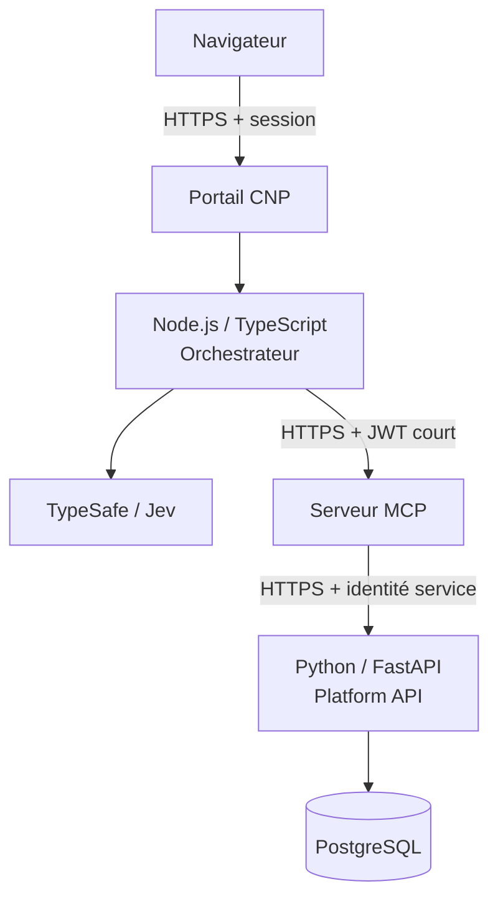
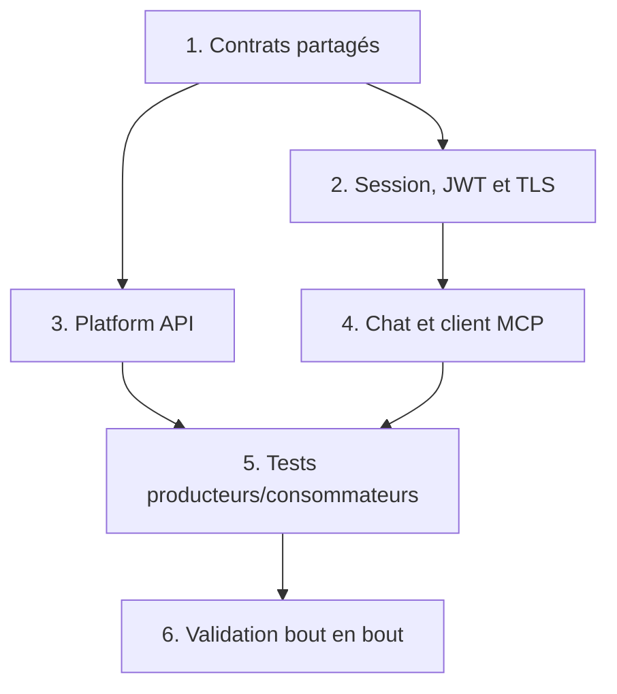

# Platform MCP Project — POC CNP

> Plan autonome des développements à réaliser côté plateforme pour consommer le serveur MCP défini dans `Project_MCP.md` et `contrats_MCP.md`.

## Objectif

La plateforme doit permettre à un utilisateur CNP authentifié de :

1. ouvrir le chat depuis le portail ;
2. envoyer une question sur les applications, déploiements, logs ou recommandations FinOps ;
3. faire classifier la demande par TypeSafe ;
4. appeler de manière sécurisée un des quatre outils MCP read-only ;
5. afficher une réponse fondée sur les résultats MCP avec sources, warnings, erreurs et correlation ID.

La plateforme doit aussi fournir au MCP une API versionnée pour lire le catalogue d'applications sans accès direct à la base de données du portail.

Documents contractuels locaux :

- `contrats_MCP.md` : source de vérité des outils, schémas, erreurs, sécurité et TypeSafe ;
- `Project_MCP.md` : organisation et tâches du serveur MCP ;
- `Platform_MCPProject.md` : organisation et tâches de la plateforme consommatrice.

---

# Partie 1 — `AGENT_PLATFORM.md`

## 1. Mission de l'agent plateforme

L'agent plateforme implémente le portail chat, l'orchestrateur, le client MCP, la sécurité de transport, l'échange de token et la Platform API Python.

Il doit :

- lire intégralement `contrats_MCP.md` avant de modifier une interface ;
- utiliser les schémas partagés du monorepo au lieu de recopier les types TypeScript ;
- garder les appels au modèle, à TypeSafe et au MCP dans le backend ;
- ne jamais appeler une source de plateforme directement depuis l'orchestrateur ;
- ne jamais envoyer les credentials du portail au MCP, au modèle ou à TypeSafe ;
- refuser une URL MCP distante en `http://` ;
- maintenir un correlation ID commun du chat jusqu'aux adaptateurs MCP ;
- conserver les erreurs internes hors de l'interface utilisateur ;
- fournir des tests de contrat exécutables sans services réels.

## 2. Règles de sécurité non négociables

- Le navigateur communique uniquement avec le backend du portail.
- Le navigateur ne reçoit jamais `TYPESAFE_API_KEY`, le token interne MCP, une clé de signature ou un credential de source.
- La session utilisateur est établie avec GitHub OAuth puis vérifiée contre la liste ou l'organisation des utilisateurs admis à CNP.
- Le token interne destiné au MCP est court, signé, limité à `aud=cnp-mcp` et `scope=cnp:read`.
- Le token MCP est envoyé uniquement dans `Authorization: Bearer`, jamais dans la query string.
- Tous les appels MCP partagés utilisent HTTPS avec vérification stricte du certificat.
- TLS 1.2 est le minimum ; TLS 1.3 est préféré.
- Il est interdit de désactiver la vérification TLS en production.
- Les certificats sont gérés par Cloud Run, l'ingress, le load balancer ou le service mesh, et non par le code applicatif.
- mTLS peut authentifier les services si une PKI est disponible, mais ne remplace jamais le JWT utilisateur.
- Toute mutation demandée dans le chat est refusée avant appel MCP.

## 3. Règles fonctionnelles

- Les seuls intents routables sont `list_applications`, `get_deployment_status`, `get_application_logs` et `get_finops_recommendation`.
- Une demande ambiguë produit une question de clarification.
- Une panne TypeSafe active un fallback contraint ; elle ne coupe pas le chat.
- Une panne MCP produit un état utilisateur contrôlé et corrélé.
- La plateforme affiche clairement les réponses partielles.
- Les champs financiers absents restent `null` et ne sont jamais reformulés comme des économies.
- L'orchestrateur ne modifie pas les données structurées retournées par le MCP.

## 4. Méthode de développement

Pour chaque fonctionnalité :

1. identifier le contrat consommé dans `contrats_MCP.md` ;
2. ajouter un test de contrat avec le mock MCP ou Platform API ;
3. implémenter le happy path ;
4. implémenter les cas timeout, indisponibilité, `partial`, `401`, `403` et entrée invalide ;
5. tester l'absence de fuite de secrets ;
6. vérifier lint, type-check, tests et build ;
7. fournir la sortie et la preuve de validation demandées.

## 5. Definition of Done

Une tâche plateforme est terminée lorsque :

- les schémas sont compatibles avec `contrats_MCP.md` ;
- les tests automatisés passent ;
- le comportement dégradé est testé ;
- les appels réseau sont chiffrés et authentifiés ;
- les erreurs sont compréhensibles pour l'utilisateur sans exposer les détails internes ;
- aucun secret n'apparaît dans le navigateur, les réponses ou les logs ;
- les documents locaux correspondent au comportement livré.

---

# Partie 2 — `PLATFORM_ARCHITECTURE.md`

## 1. Architecture cible



## 2. Organisation dans le monorepo

```text
cnp-mcp-poc/
├── apps/
│   ├── portal/                    # interface chat ou intégration au portail existant
│   ├── orchestrator/              # Node.js/TypeScript
│   │   ├── src/auth/
│   │   ├── src/chat/
│   │   ├── src/mcp-client/
│   │   ├── src/typesafe/
│   │   ├── src/orchestration/
│   │   └── src/observability/
│   └── mcp-server/                # décrit dans Project_MCP.md
├── services/
│   └── platform-api/              # Python/FastAPI
│       ├── app/api/
│       ├── app/auth/
│       ├── app/models/
│       ├── app/repositories/
│       ├── app/schemas/
│       └── tests/
├── packages/
│   ├── contracts/                 # Zod + JSON Schema partagés
│   ├── mcp-test-client/            # client et fake serveur de test
│   └── test-fixtures/
├── docs/
│   ├── Project_MCP.md
│   ├── contrats_MCP.md
│   └── Platform_MCPProject.md
└── docker-compose.yml
```

Même dans le monorepo, les trois services disposent de points d'entrée, variables, tests, images et permissions distincts.

## 3. Stack plateforme

| Couche | Technologie | Rôle |
|---|---|---|
| Portail | Stack frontend existante | Chat, streaming et restitution des résultats |
| Backend/orchestrateur | Node.js LTS + TypeScript | Auth, TypeSafe, client MCP et boucle d'outils |
| Validation Node.js | Zod | Entrées chat, événements et sorties TypeSafe/MCP |
| Platform API | Python 3.13 + FastAPI | API read-only du catalogue |
| Accès données | SQLAlchemy 2 + Pydantic + `psycopg` | Mapping et validation PostgreSQL |
| Base | PostgreSQL | Catalogue CNP |
| Tests Node.js | Vitest | Unitaires, contrats et intégration |
| Tests Python | Pytest | API, repositories et autorisation |
| Auth portail | GitHub OAuth | Session utilisateur |
| Token MCP | JWT asymétrique court | Identité utilisateur et scope read-only |
| Transport | HTTPS, TLS 1.2 minimum | Chiffrement et identité serveur |
| Certificats | Certificats managés ; mTLS optionnel | Renouvellement automatique et identité de service |
| Secrets | Vault ou secret runtime | Clés, credentials et API keys |

## 4. API publique du backend portail

### `POST /api/v1/mcp/chat/turn`

Cette route est appelée par le navigateur. Elle exige une session portail valide et une protection CSRF adaptée au mécanisme de session.

#### Requête

```ts
type ChatTurnRequest = {
  conversationId?: string;
  message: string; // 1 à 4000 caractères
  context?: {
    applicationId?: string;
    environment?: "development" | "staging" | "production";
    openPage?: "applications_list" | "application_overview" | "deployment" | "logs" | "finops" | "unknown";
    selectedTab?: string;
    timeRange?: { from: string; to: string };
    filters?: {
      logLevel?: Array<"debug" | "info" | "warning" | "error">;
      deploymentStatus?: string[];
      search?: string;
    };
    language?: "fr" | "en";
    timezone?: string;
  };
};
```

Le contexte du body est une déclaration de l'interface et n'est jamais une autorité. Le backend valide chaque champ et reconstruit `KnownContextV1`. Toute identité, rôle, scope ou liste d'outils fournie par le navigateur est rejetée ; ces informations proviennent uniquement de la session et de la configuration serveur.

#### Réponse

La réponse utilise Server-Sent Events avec `Content-Type: text/event-stream`. Chaque événement contient un JSON validé :

```ts
type ChatEvent =
  | {
      type: "turn_started";
      conversationId: string;
      correlationId: string;
    }
  | {
      type: "clarification_required";
      correlationId: string;
      question: string;
    }
  | {
      type: "tool_started";
      correlationId: string;
      tool: ApprovedToolName;
    }
  | {
      type: "tool_completed";
      correlationId: string;
      tool: ApprovedToolName;
      status: "success" | "partial" | "error";
    }
  | {
      type: "warning";
      correlationId: string;
      code: string;
      message: string;
    }
  | {
      type: "answer_delta";
      correlationId: string;
      text: string;
    }
  | {
      type: "turn_completed";
      correlationId: string;
      sources: Array<{ source: string; status: string }>;
    }
  | {
      type: "error";
      correlationId: string;
      code: string;
      message: string;
      retryable: boolean;
    };
```

`ApprovedToolName` vaut exactement :

```ts
type ApprovedToolName =
  | "list_applications"
  | "get_deployment_status"
  | "get_application_logs"
  | "get_finops_recommendation";
```

Le frontend ne reçoit pas les prompts système, réponses TypeSafe brutes, tokens, stack traces ou détails de connexion.

## 5. Platform API Python

La Platform API est une API interne read-only consommée par l'adaptateur `platform-api` du MCP.

### 5.1 Endpoints

| Méthode | Route | Usage |
|---|---|---|
| `GET` | `/healthz` | Processus vivant |
| `GET` | `/readyz` | DB et dépendances indispensables disponibles |
| `GET` | `/v1/applications` | Catalogue filtré et paginé |
| `GET` | `/v1/applications/{applicationId}` | Détail et profil du workload |

### 5.2 `GET /v1/applications`

Query parameters :

```text
query?: string
environment?: dev | prod
limit?: integer, défaut 20, maximum 100
cursor?: string
```

Réponse `200` :

```json
{
  "applications": [
    {
      "applicationId": "majoutes-api",
      "name": "Majoutes API",
      "team": "majoutes",
      "repositoryUrl": "https://git.example/majoutes-api",
      "environments": [
        { "name": "dev", "enabled": true },
        { "name": "prod", "enabled": true }
      ]
    }
  ],
  "nextCursor": null
}
```

Cette réponse correspond exactement à `ListApplicationsData` dans `contrats_MCP.md`. Le MCP ajoute ensuite l'enveloppe `ToolResponse`.

### 5.3 `GET /v1/applications/{applicationId}`

Réponse `200` :

```ts
type PlatformApplicationDetail = {
  applicationId: string;
  name: string;
  team: string;
  repositoryUrl: string;
  environments: Array<{
    name: "dev" | "prod";
    enabled: boolean;
  }>;
  workloadProfile: {
    stateless: boolean | null;
    requestDriven: boolean | null;
    longRunning: boolean | null;
    persistentStorage: boolean | null;
    specialNetworking: boolean | null;
    availabilityConstraints: string[];
  };
};
```

Le `workloadProfile` fournit les faits nécessaires au moteur FinOps déterministe. Une valeur inconnue reste `null`.

### 5.4 Erreurs Platform API

```ts
type PlatformApiError = {
  code:
    | "INVALID_INPUT"
    | "UNAUTHENTICATED"
    | "FORBIDDEN"
    | "APPLICATION_NOT_FOUND"
    | "INTERNAL_ERROR";
  message: string;
  correlationId: string;
};
```

| HTTP | Code |
|---|---|
| `400` | `INVALID_INPUT` |
| `401` | `UNAUTHENTICATED` |
| `403` | `FORBIDDEN` |
| `404` | `APPLICATION_NOT_FOUND` |
| `500` | `INTERNAL_ERROR` |

La Platform API n'expose pas de stack trace, requête SQL, modèle interne, credential ou champ secret.

## 6. Authentification et jetons

### 6.1 Session portail

- GitHub OAuth authentifie l'utilisateur.
- Le backend vérifie l'admission CNP.
- Le cookie de session utilise `Secure`, `HttpOnly` et une politique `SameSite` adaptée.
- Une vérification CSRF protège les routes mutables du backend, dont l'envoi d'un tour de chat.

### 6.2 Token interne MCP

Le backend génère un JWT d'une durée recommandée de cinq minutes :

```json
{
  "iss": "cnp-portal",
  "aud": "cnp-mcp",
  "sub": "github-user-id",
  "login": "github-login",
  "role": "cnp_reader",
  "scopes": ["cnp:read"],
  "iat": 1789552800,
  "exp": 1789553100,
  "jti": "unique-token-id"
}
```

Utiliser une signature asymétrique avec algorithmes autorisés explicitement configurés. Pour le POC, `RS256` est le défaut proposé. La clé privée est dans Vault ; le MCP utilise la clé publique ou un endpoint JWKS interne. `alg=none` et les algorithmes non configurés sont refusés.

### 6.3 Identité Platform API

Le MCP appelle la Platform API avec une identité de service dédiée à `aud=cnp-platform-api`. La Platform API n'accepte ni le token GitHub ni le cookie portail.

Comme tous les utilisateurs admis voient toutes les applications dans le POC, l'identité utilisateur propagée à la Platform API est utilisée pour l'audit, pas pour filtrer le catalogue. Tout header d'identité utilisateur est ignoré si l'appelant n'est pas d'abord authentifié comme service MCP.

## 7. Client MCP de l'orchestrateur

### 7.1 Connexion

- Local : `stdio` ou endpoint HTTP sur `127.0.0.1`.
- Partagé : `MCP_BASE_URL=https://.../mcp` uniquement.
- Validation TLS stricte ; bundle CA privé configurable seulement si la PKI CNP l'exige.
- Aucun fallback automatique de HTTPS vers HTTP.
- mTLS configurable par chemins de secrets montés si le service mesh ne le termine pas lui-même.

### 7.2 Requête Streamable HTTP

```http
POST /mcp HTTP/1.1
Host: mcp.cnp.example
Origin: https://portal.cnp.example
Authorization: Bearer <short-lived-token>
Content-Type: application/json
Accept: application/json, text/event-stream
MCP-Protocol-Version: <negotiated-version>
```

Après initialisation, le client renvoie `Mcp-Session-Id` lorsque le serveur en a fourni un. Le SDK MCP doit gérer la négociation de version et la session ; l'application ne duplique pas cette logique dans plusieurs modules.

### 7.3 Gestion des échecs

| Échec | Comportement plateforme |
|---|---|
| URL distante `http://` | Refus au démarrage avec `TLS_REQUIRED` |
| Certificat invalide ou expiré | Interrompre avant token, `TLS_CERTIFICATE_INVALID` |
| `401` MCP | Renouveler une fois le token si la session est valide, sinon reconnecter l'utilisateur |
| `403` MCP | Afficher un refus, ne pas retry |
| Timeout | Retry borné uniquement si l'opération read-only est idempotente |
| `429` | Respecter `Retry-After`, pas de boucle de retry |
| Réponse `partial` | Afficher données et warnings |
| Réponse de schéma invalide | Rejeter la réponse et journaliser une erreur de contrat |

## 8. KnownContextV1

Avant tout appel à TypeSafe, le backend construit un contexte déterministe, versionné et validé :

```ts
type KnownContextV1 = {
  schemaVersion: "1.0";
  actor: {
    userId: string;
    roles: Array<"manager" | "devops" | "dev">;
    authenticated: true;
  };
  navigation: {
    openPage: "applications_list" | "application_overview" | "deployment" | "logs" | "finops" | "unknown";
    selectedTab?: string;
  };
  target: {
    applicationId?: string;
    environment?: "development" | "staging" | "production";
  };
  view: {
    timeRange?: { from: string; to: string };
    filters?: {
      logLevel?: Array<"debug" | "info" | "warning" | "error">;
      deploymentStatus?: string[];
      search?: string;
    };
  };
  permissions: { allowedTools: ApprovedToolName[] };
  conversation: {
    confirmedApplicationId?: string;
    confirmedEnvironment?: "development" | "staging" | "production";
    pendingClarificationId?: string;
  };
  locale: { language: "fr" | "en"; timezone: string };
};
```

### 8.1 Provenance et priorité

- `actor` vient exclusivement de la session serveur authentifiée ; son identifiant est interne et opaque.
- `permissions.allowedTools` est recalculé par le backend à partir de l'allowlist read-only. Le rôle ne constitue pas encore une autorisation dans le POC.
- La cible utilise, dans l'ordre, la sélection UI, les paramètres de page, le dernier contexte confirmé côté serveur, puis une valeur explicitement détectée dans la demande et validée dans le catalogue.
- Un changement explicite d'application ou d'environnement remplace le contexte conversationnel précédent.
- `conversation` provient exclusivement de la session serveur.
- `navigation`, `view` et `locale` peuvent être déclarés par l'interface mais sont validés avec des schémas stricts.

### 8.2 Validations

- L'application doit correspondre exactement à une entrée du catalogue CNP.
- L'environnement doit être activé pour l'application. Les alias `dev` et `prod` du catalogue sont normalisés en `development` et `production`.
- Plusieurs correspondances d'application produisent une clarification ; la première correspondance n'est jamais choisie silencieusement.
- Les périodes invalides sont omises et les périodes de logs sont bornées à 24 heures.
- Les niveaux de logs inconnus sont omis, les tableaux sont bornés et la recherche est limitée à 200 caractères.
- Les fuseaux horaires invalides utilisent le défaut serveur `Europe/Paris`.
- Les champs inconnus sont rejetés.
- La frontière MCP convertit explicitement `development` vers `dev` et `production` vers `prod`. Tant que le contrat MCP ne supporte pas `staging`, une cible staging ne déclenche aucun appel d'outil exigeant un environnement et produit une clarification.

### 8.3 Données interdites

`KnownContextV1` ne contient jamais de cookie, token GitHub, JWT MCP, clé TypeSafe ou fournisseur, credential, code source, logs bruts, HTML, historique complet, endpoint interne ou métadonnée applicative pouvant être retrouvée depuis `applicationId`.

Le `correlationId`, le request ID et les timestamps restent dans les métadonnées de requête ou les événements `ChatEvent`, séparés du contexte métier.

## 9. Orchestration et TypeSafe

Ordre obligatoire :

1. valider la session utilisateur et l'admission CNP ;
2. valider `ChatTurnRequest` ;
3. créer le correlation ID ;
4. construire et valider `KnownContextV1` sans appel IA ;
5. appeler TypeSafe derrière son feature flag avec `userRequest`, `availableReadOnlyTools` et `knownContext` ;
6. appliquer les seuils et le fallback de `contrats_MCP.md` ;
7. demander une clarification ou refuser la mutation si nécessaire ;
8. obtenir un token interne MCP ;
9. découvrir/vérifier l'allowlist des outils ;
10. construire et valider les arguments ;
11. appeler le MCP via HTTPS ;
12. valider `ToolResponse` ;
13. produire une réponse conversationnelle fondée uniquement sur `data`, `warnings`, `errors` et `meta.sources` ;
14. transmettre les événements SSE au portail.

La boucle autorise au maximum trois appels d'outil par tour dans le POC. Elle applique un budget temporel global configurable. Un outil non présent dans `ApprovedToolName` est refusé même si le modèle le demande.

## 10. Variables de configuration

| Variable | Service | Secret | Règle |
|---|---|---|---|
| `MCP_BASE_URL` | orchestrateur | Non | `https://` obligatoire hors local |
| `MCP_EXPECTED_ORIGIN` | orchestrateur/MCP | Non | origine exacte du portail |
| `MCP_AUDIENCE` | orchestrateur/MCP | Non | `cnp-mcp` |
| `MCP_CA_BUNDLE_PATH` | orchestrateur | Selon contenu | seulement pour CA privée approuvée |
| `MCP_MTLS_CERT_PATH` | orchestrateur | Oui | optionnel, secret monté |
| `MCP_MTLS_KEY_PATH` | orchestrateur | Oui | optionnel, secret monté |
| `MCP_CONNECT_TIMEOUT_MS` | orchestrateur | Non | timeout court et borné |
| `MCP_TOOL_TIMEOUT_MS` | orchestrateur | Non | timeout par appel |
| `TYPESAFE_API_KEY` | orchestrateur | Oui | Vault/runtime uniquement |
| `TYPESAFE_ENABLED` | orchestrateur | Non | feature flag |
| `DATABASE_URL` | Platform API | Oui | secret runtime |
| `PLATFORM_API_AUDIENCE` | MCP/API | Non | `cnp-platform-api` |
| `JWT_SIGNING_KEY` | backend portail | Oui | clé privée Vault |
| `JWT_JWKS_URL` | MCP | Non | URL interne HTTPS |

Les valeurs secrètes ne figurent jamais dans `.env.example`; celui-ci ne contient que les noms et des placeholders non fonctionnels.

## 11. Observabilité

Les trois services utilisent le même `correlationId`. Les logs structurés incluent :

- service et version ;
- correlation ID ;
- outil et cible ;
- statut et durée ;
- code d'erreur ;
- disponibilité des dépendances ;
- état du fallback TypeSafe.

Ils excluent :

- cookies et tokens ;
- clés/API keys ;
- texte brut de la conversation dans la télémétrie du classifieur ;
- logs applicatifs bruts hors réponse explicitement autorisée ;
- données SQL et stack traces côté client.

## 12. Mapping exact plateforme ↔ MCP

| Producteur plateforme | Contrat consommé par le MCP | Vérification |
|---|---|---|
| `GET /v1/applications` | `ListApplicationsData` | Test JSON Schema partagé |
| `GET /v1/applications/{id}` | Résolution de l'application et profil FinOps | Test Pydantic + fixture partagée |
| JWT `aud=cnp-mcp`, `scope=cnp:read` | Validation AuthN/AuthZ MCP | Tests 401/403/expiration/audience |
| `Origin` configurée | Allowlist Origin MCP | Test origine valide/invalide |
| Client Streamable HTTP | Endpoint `/mcp` | Test initialisation et découverte |
| Arguments orchestrateur | Schémas d'entrée des quatre outils | Validation Zod avant appel et côté MCP |
| `ToolResponse<T>` MCP | Événements SSE et réponse du modèle | Validation Zod avant affichage |
| `meta.sources` et warnings | Interface du portail | Test d'affichage `partial` |
| correlation ID | Audit MCP et Platform API | Test de propagation bout en bout |

---

# Partie 3 — `PLATFORM_TASKS.md`

## Phase 0 — Contrats et environnement

### PLATFORM-001 — Installer les contrats partagés

**Objectif** : rendre les mêmes schémas disponibles dans l'orchestrateur, le MCP et les tests.

**Développements** :

- créer le package `packages/contracts` ;
- exporter `ApprovedToolName`, entrées/sorties des outils et `ToolResponse` ;
- générer les JSON Schema ;
- fournir les fixtures compatibles et incompatibles ;
- ajouter un contrôle empêchant les dépendances circulaires entre orchestrateur et MCP.

**Sorties attendues** : package versionné, schémas générés et fixtures.

**Validation** :

- [ ] l'orchestrateur et le MCP compilent contre la même version ;
- [ ] une modification incompatible casse les tests de contrat ;
- [ ] aucun type métier n'est recopié dans les applications Node.js.

### PLATFORM-002 — Préparer l'exécution locale

**Objectif** : démarrer portail, orchestrateur, MCP, Platform API et PostgreSQL localement.

**Sorties attendues** : `docker-compose.yml`, exemples de configuration sans secrets et commandes de démarrage.

**Validation** :

- [ ] tous les services démarrent avec mocks et fixtures ;
- [ ] le MCP HTTP local écoute uniquement sur `127.0.0.1` ;
- [ ] aucun secret réel n'est requis pour les tests de contrat.

## Phase 1 — Authentification et transport

### PLATFORM-003 — Valider la session GitHub et l'admission CNP

**Objectif** : établir l'identité utilisateur avant toute orchestration.

**Sorties attendues** : middleware de session, contrôle d'admission et protection CSRF.

**Validation** :

- [ ] utilisateur anonyme rejeté ;
- [ ] utilisateur GitHub non admis rejeté ;
- [ ] cookie configuré `Secure` et `HttpOnly` en environnement partagé ;
- [ ] aucune donnée d'identité fournie dans le body n'est utilisée comme autorité.

### PLATFORM-004 — Émettre le token interne MCP

**Objectif** : fournir au client MCP un JWT court, signé et limité.

**Sorties attendues** : service de token, clé privée dans Vault et clé publique/JWKS pour le MCP.

**Validation** :

- [ ] claims conformes au présent document ;
- [ ] durée recommandée de cinq minutes ;
- [ ] audience, issuer, scope et algorithme épinglés ;
- [ ] token expiré, mauvaise audience et mauvaise signature rejetés ;
- [ ] token absent des logs et du navigateur.

### PLATFORM-005 — Sécuriser le client MCP avec TLS

**Objectif** : chiffrer et authentifier tous les appels MCP partagés.

**Sorties attendues** : configuration HTTPS, validation de certificat, Origin fixe et support mTLS optionnel.

**Validation** :

- [ ] `http://` distant est refusé au démarrage ;
- [ ] certificats expiré, inconnu et mauvais nom sont rejetés ;
- [ ] le bearer token n'est pas envoyé si TLS échoue ;
- [ ] l'origine attendue est envoyée ;
- [ ] aucune option ne désactive TLS en production ;
- [ ] la rotation du certificat ne demande pas de rebuild.

## Phase 2 — Platform API

### PLATFORM-006 — Créer la Platform API FastAPI

**Objectif** : exposer les endpoints health, readiness, liste et détail.

**Sorties attendues** : service Python conteneurisé et OpenAPI.

**Validation** :

- [ ] les quatre endpoints documentés existent ;
- [ ] les paramètres invalides produisent `400` ;
- [ ] les réponses suivent les schémas Pydantic ;
- [ ] aucune route write n'est exposée.

### PLATFORM-007 — Implémenter le repository PostgreSQL

**Objectif** : lire le catalogue sans exposer le modèle interne.

**Sorties attendues** : modèles SQLAlchemy, queries paramétrées, pagination et mapping API.

**Validation** :

- [ ] aucune concaténation SQL à partir de l'entrée utilisateur ;
- [ ] limite maximale 100 ;
- [ ] application inconnue produit `404 APPLICATION_NOT_FOUND` ;
- [ ] champs secrets et internes exclus ;
- [ ] inconnues workload restent `null`.

### PLATFORM-008 — Authentifier les appels MCP vers la Platform API

**Objectif** : réserver l'API interne au service MCP.

**Sorties attendues** : validation d'identité de service et audit corrélé.

**Validation** :

- [ ] appel anonyme rejeté ;
- [ ] token destiné à une autre audience rejeté ;
- [ ] identité utilisateur en header ignorée sans identité MCP valide ;
- [ ] correlation ID propagé dans les logs et erreurs.

## Phase 3 — Chat et orchestration

### PLATFORM-009 — Créer l'endpoint chat SSE

**Objectif** : recevoir un tour authentifié et diffuser les événements documentés.

**Sorties attendues** : route `/api/v1/mcp/chat/turn`, validation Zod et flux SSE.

**Validation** :

- [ ] message vide ou supérieur à 4000 caractères rejeté ;
- [ ] les huit types d'événements sont validés ;
- [ ] une déconnexion du navigateur ne vaut pas implicitement annulation MCP ; si l'annulation est supportée, l'orchestrateur envoie explicitement une notification d'annulation ;
- [ ] aucun secret ou détail fournisseur n'est diffusé.

### PLATFORM-010 — Intégrer TypeSafe

**Objectif** : classifier intent, impact et besoin de clarification.

**Sorties attendues** : module isolé, feature flag, timeouts, fallback et métriques.

**Validation** :

- [ ] seul `userRequest`, `availableReadOnlyTools` et le `KnownContextV1` validé sont envoyés ;
- [ ] l'identité et les rôles proviennent uniquement de la session serveur ;
- [ ] les filtres et périodes sont strictement validés et bornés ;
- [ ] les seuils sont appliqués localement ;
- [ ] ambiguïté produit `clarification_required` ;
- [ ] mutation produit un refus sans appel MCP ;
- [ ] panne TypeSafe active le fallback contraint.

### PLATFORM-011 — Implémenter le client MCP

**Objectif** : initialiser la session, découvrir les outils et exécuter les appels Streamable HTTP.

**Sorties attendues** : client partagé, gestion de session, headers, timeout et validation de réponse.

**Validation** :

- [ ] seuls les quatre outils approuvés sont acceptés ;
- [ ] `Accept`, `Authorization`, `Origin` et version MCP sont transmis ;
- [ ] `Mcp-Session-Id` est renvoyé lorsqu'il existe ;
- [ ] réponses JSON et SSE sont supportées ;
- [ ] une réponse invalide est rejetée comme erreur de contrat.

### PLATFORM-012 — Implémenter la boucle d'orchestration

**Objectif** : transformer une conversation en appels MCP bornés et en réponse fondée.

**Sorties attendues** : state machine ou service d'orchestration testable.

**Validation** :

- [ ] maximum trois appels par tour ;
- [ ] budget temporel global appliqué ;
- [ ] arguments validés avant l'appel ;
- [ ] données structurées MCP non modifiées ;
- [ ] valeurs financières absentes jamais inventées ;
- [ ] `partial` conserve données et warnings.

### PLATFORM-013 — Construire l'interface chat

**Objectif** : rendre les états du système compréhensibles.

**Sorties attendues** : messages, streaming, chargement, clarification, tool progress, warnings et erreurs.

**Validation** :

- [ ] l'utilisateur voit l'outil en cours sans voir ses credentials ;
- [ ] sources et warnings partiels sont visibles ;
- [ ] une demande hors périmètre est expliquée ;
- [ ] le correlation ID est visible dans les erreurs supportables ;
- [ ] la conversation reste utilisable après fallback TypeSafe.

## Phase 4 — Observabilité et validation

### PLATFORM-014 — Ajouter logs, métriques et traces

**Objectif** : suivre un tour de bout en bout.

**Sorties attendues** : logs JSON corrélés, métriques TypeSafe/MCP/API et dashboard minimal.

**Validation** :

- [ ] un correlation ID relie portail, orchestrateur, MCP et Platform API ;
- [ ] disponibilité, latence et raisons de fallback sont mesurées ;
- [ ] tokens, secrets et texte TypeSafe brut absents de la télémétrie.

### PLATFORM-015 — Exécuter les tests de compatibilité

**Objectif** : prouver que plateforme et MCP peuvent être développés séparément.

**Sorties attendues** : fake MCP, fake Platform API, tests consommateurs/producteurs et rapport de compatibilité.

**Validation** :

- [ ] la plateforme fonctionne contre le fake MCP ;
- [ ] le MCP fonctionne contre la fake Platform API ;
- [ ] les mêmes fixtures passent contre les implémentations réelles ;
- [ ] tout écart de schéma échoue dans la CI ;
- [ ] les erreurs HTTP/MCP sont mappées sans ambiguïté.

### PLATFORM-016 — Valider les scénarios bout en bout

**Scénarios obligatoires** :

1. lister les applications ;
2. consulter un déploiement ;
3. récupérer des logs bornés et expurgés ;
4. obtenir une recommandation FinOps sans chiffres inventés ;
5. clarifier une demande ambiguë ;
6. refuser une mutation ;
7. continuer en fallback lorsque TypeSafe est indisponible ;
8. afficher une réponse partielle ;
9. rejeter un utilisateur non admis ;
10. rejeter une URL HTTP distante ;
11. rejeter un certificat invalide ;
12. rejeter une origine ou un token invalide.

**Sorties attendues** : rapport, traces corrélées et preuves des douze scénarios.

**Validation** :

- [ ] les douze scénarios passent ;
- [ ] aucun secret n'est exposé ;
- [ ] aucune mutation n'est accessible ;
- [ ] chaque réponse indique ses sources et limites ;
- [ ] plateforme et MCP peuvent être remplacés individuellement par leur fake contractuel.

---

## Ordre de réalisation recommandé



## Résultat final attendu

Le développement est validé lorsque l'équipe plateforme peut exécuter ses tests contre un fake MCP conforme à `contrats_MCP.md`, pendant que l'équipe MCP peut exécuter ses tests contre une fake Platform API conforme au présent document. Le remplacement des fakes par les services réels ne doit nécessiter aucun changement de schéma, de route, d'en-tête, de code d'erreur ou de politique d'authentification.
